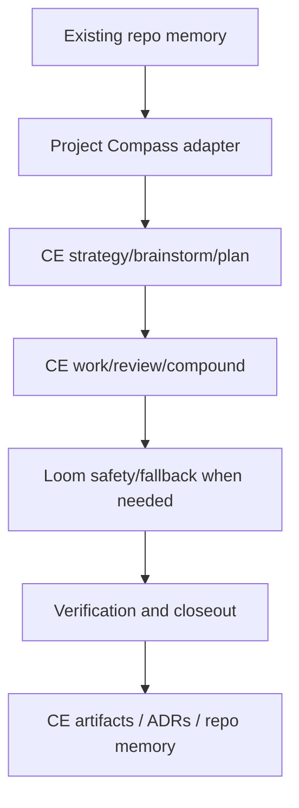
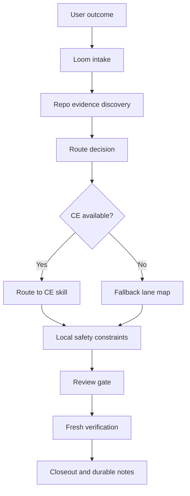

# Dev Skills

This repository keeps a small personal Codex skill set.

The previous Rust workstream / upper-planner workflow has been retired. Use Compound Engineering as
the preferred engineering loop. Use Project Compass only to adapt existing repo memory into CE, and
use Loom only as a CE guide, local safety adapter, and fallback lane mapper.

## Workflow Stack

```text
Project Compass adapter -> Compound Engineering -> Loom safety/fallback -> closeout / memory update
```

- **Project Compass** reads legacy/local project memory and summarizes it for CE. It does not own a
  competing roadmap or direction system.
- **Compound Engineering** owns the default brainstorm, plan, work, review, and compound loop.
- **Loom** routes older Loom requests to CE, passes repo-local constraints, and falls back to a lane
  map only when CE is unavailable or unsuitable.
- **Native threads/subagents** run only through CE or after Loom has an approved fallback lane map.
- **CE artifacts, ADRs, specs, and repo docs** preserve decisions, progress, and closeout evidence.

## Core Model

The stack has five primitives:

- **CE direction**: `STRATEGY.md`, brainstorms, plans, and solution docs.
- **Repo authority**: ADRs, architecture maps, specs, repo instructions, and local constraints ordered by precedence.
- **Goal contract**: one executable outcome from CE plan or a fallback lane map.
- **Run envelope**: local scope, stop rules, allowed changes, forbidden changes, and evidence required for one goal cycle.
- **Evidence closeout**: verified changes, reviewer findings, remaining risks, archive state, and the next decision.

Everything else is an adapter. CE owns the main engineering cycle. Project Compass adapts legacy or
local memory into CE. Loom preserves local safety policy and proves fallback parallelism only when CE
is not the right tool for the current step.



## Why Project Compass Exists

Many repos already have old `.loom`, `.planning`, ADR, roadmap, or workstream state. CE should not
ignore that context, but this repository should not create a second roadmap system beside CE.

Project Compass exists to read and reconcile existing memory, classify stale versus active facts,
and route the useful summary into `ce-strategy`, `ce-brainstorm`, `ce-plan`, `ce-work`, or Loom
fallback. It should not author a new north star, roadmap, or next-goal system when CE is available.

## Why Loom Exists

Compound Engineering should be the default workflow, but it does not know every local repo rule in
this personal skill set. Loom exists as a compatibility and safety layer for:

- old habits or prompts that say "use Loom"
- repo-specific constraints such as protected main branches, worktree roots, dirty user edits, exact
  writable files, and commit policy
- fallback execution when CE is not installed, CE agents are missing, or a task is too narrow for the
  full CE loop

## Loom Workflow

1. Detect whether CE skills and agents are installed.
2. Read repo-local authority: instructions, CE artifacts, ADRs/specs, current task evidence, dirty
   state, modules, manifests, and tests.
3. Route to the right CE entrypoint: `ce-brainstorm`, `ce-plan`, `ce-work`, `ce-debug`,
   `ce-code-review`, or `ce-compound`.
4. Pass local constraints into CE: worktree policy, protected files, dirty user edits, verification,
   commit policy, and stop conditions.
5. Fall back to a conservative lane map only when CE is unavailable or unsuitable.
6. Close out with completed work, remaining risks, local state, and durable decisions that should be
   recorded in CE artifacts, ADRs/specs, or project memory.



## Influences

- [`planning-with-files`](https://github.com/OthmanAdi/planning-with-files): keep `task_plan.md`,
  `findings.md`, and `progress.md` as working memory; use scoped `.planning/<slug>/` directories for
  parallel or unrelated active topics; preserve errors and progress so sessions can resume after
  context loss.
- Spellbook-style skills: keep the skill concise and action-oriented instead of building a large
  workflow framework.
- Matt Pocock-style skills: prefer small composable skills such as `diagnose`, `tdd`, `to-issues`,
  and `improve-codebase-architecture` over one all-purpose planner.
- Trellis: an influence for explicit state and finish discipline, not a runtime dependency.
- Codex native threads/subagents: use lane maps, disjoint writable files, independent reviewers, and merge
  gates to make subagent work safe.
- Eugene Yan's AI workflow writing: treat context, verification, delegation, and feedback loops as
  infrastructure for reliable autonomy.
- EveryInc Compound Engineering: use the full plugin as the preferred upstream workflow for
  brainstorm / plan / work / review / compound loops, rather than copying its large skill bodies
  into this lightweight set.

## Why This Should Work

The design is intentionally narrow. This repository should not out-compete a maintained external
workflow with its own agents and tests. It keeps the small pieces CE cannot know locally: project
direction memory, repo-specific safety constraints, commit discipline, and fallback lane discovery.

Fallback Loom lanes are expected to work when:

- lane writable files are disjoint
- shared contracts are stable or handled serial-first
- each lane has an independent verification surface
- reviewers are read-only and separate from workers
- high-context repo files are forbidden unless explicitly targeted

When those conditions are not true, Loom should say so and produce a serial, research, or
architecture-first plan instead of forcing fake parallelism.

## Retained Skills

- [`commit-work`](./skills/engineering/commit-work/SKILL.md) — create safe reviewable git commits.
- [`codex-session-recovery`](./skills/engineering/codex-session-recovery/SKILL.md) — recover context
  from Codex session files.
- [`humanizer`](./skills/misc/humanizer/SKILL.md) — make prose sound more natural.
- [`project-compass`](./skills/engineering/project-compass/SKILL.md) — adapt legacy/local project
  memory into CE without creating a competing direction workflow.
- [`loom`](./skills/engineering/loom/SKILL.md) — route broad work to CE, pass local safety context,
  and provide fallback lane discovery.

Upstream skills such as `diagnose`, `tdd`, `triage`, `to-prd`, `to-issues`,
`improve-codebase-architecture`, and `zoom-out` are optional. Compound Engineering is the preferred
external workflow: install its full plugin and agent set, then let Project Compass and Loom route
context into CE skills when available. Keep this repository self-contained by default; vendor
upstream skills only when the source URL, license, and update path are recorded in
`upstream-skills.json`.

## Install

Install the retained local skills into Codex:

```powershell
python scripts\install_dev_skills.py --force
```

The installer also removes obsolete managed skills listed in `skills.json` under `remove.skills`.
Restart Codex after installing or updating skills.

To also install the recommended Compound Engineering external workflow, use the explicit CE flag:

```powershell
python scripts\install_dev_skills.py --force --install-ce
```

PowerShell wrapper equivalent:

```powershell
.\scripts\install-dev-skills.ps1 -Force -InstallCompoundEngineering
```

The CE flag registers the Codex marketplace and installs CE's custom agents. It intentionally does
not run by default because it modifies external Codex plugin state and uses `bunx`.

## Upstream Skill Sync

Use `upstream-skills.json` to decide which external skills are worth vendoring. Use dry-run mode
first:

```powershell
python scripts\sync_upstream_skills.py --list
python scripts\sync_upstream_skills.py --skill diagnose
python scripts\sync_upstream_skills.py --skill diagnose --write --force
```

The sync script records upstream repository URL, license, upstream path, ref, and sync time in each
vendored skill's `SOURCE.md`.

Compound Engineering is tracked in `upstream-skills.json` as `external-plugin-preferred`. The
installer's `--install-ce` flag runs the automatic parts, equivalent to:

```powershell
codex plugin marketplace add EveryInc/compound-engineering-plugin
bunx @every-env/compound-plugin install compound-engineering --to codex
```

Then open Codex `/plugins`, install the `compound-engineering` plugin, and restart Codex. The Codex
plugin install provides skills; the Bun step provides the custom CE agents used by review and
research-heavy workflows.

Default workflow policy:

- Prefer routing to Compound Engineering over absorbing large workflow prompts.
- Vendor upstream skills only when `upstream-skills.json` marks them as stable candidates.
- Prefer invoking an installed Compound Engineering plugin over vendoring individual `ce-*` skills.
- Keep `threads`-style fallback orchestration inside Loom so native subagent use works when CE is unavailable.
- Worker lanes may self-commit after green verification when the run envelope allows it; they must not
  push, merge, amend, or rewrite shared history without explicit approval.
- New worker worktrees should live outside the main repo, under
  `../<repo-name>-worktrees/<goal-slug>/<lane-id>`.

## Repository Policy

- Repository docs and skill bodies are written in English.
- Do not reintroduce a competing workstream workflow here.
- Keep the workflow lightweight and self-contained; external skills must be optional or vendored with attribution.
