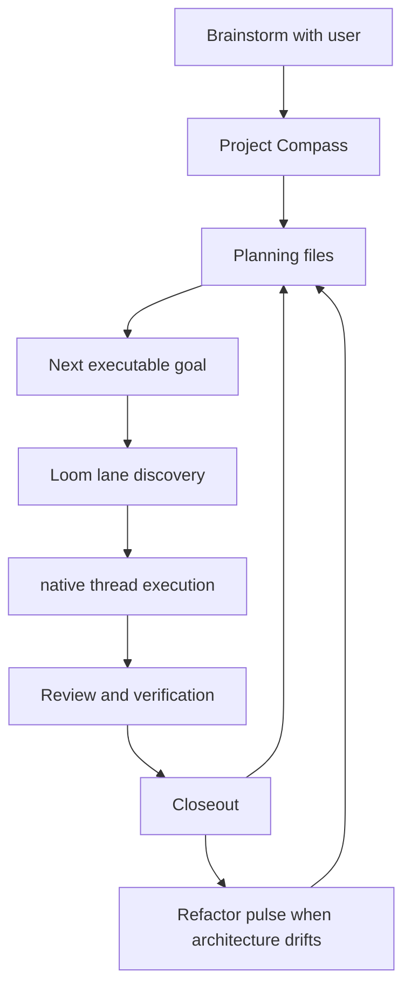
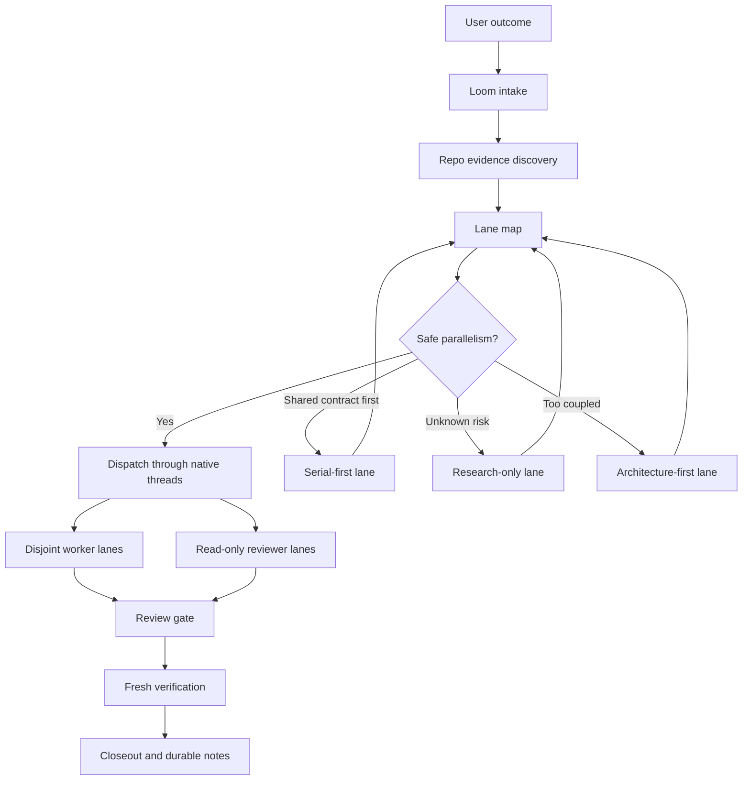

# Dev Skills

This repository keeps a small personal Codex skill set.

The previous Rust workstream / upper-planner workflow has been retired. Use Project Compass for
lightweight file-based project state and long-term direction. Use Loom for repo-local parallel lane
discovery and orchestration.

## Workflow Stack

```text
Project Compass -> Loom -> native threads/subagents -> closeout / memory update
```

- **Project Compass** clarifies long-term direction, project memory, capability maps, architecture
  boundaries, roadmap phases, and the next executable goal.
- **Loom** turns a clarified goal into an evidence-backed lane map and review-gated execution plan.
- **Native threads/subagents** run only after Loom has an approved lane map.
- **ADR/spec/workstream docs** preserve decisions, progress, and closeout evidence.

## Core Model

The stack has five primitives:

- **Direction**: north star, target users, non-goals, capability map, and quality bar.
- **Authority**: ADRs, architecture maps, specs, roadmap, and active work files ordered by precedence.
- **Goal contract**: one executable outcome with done-when, dependencies, risks, verification, and context manifest.
- **Run envelope**: the scope, stop rules, allowed changes, forbidden changes, and evidence required for one goal cycle.
- **Evidence closeout**: verified changes, reviewer findings, remaining risks, archive state, and the next decision.

Everything else is an adapter. Project Compass selects and maintains the goal. Loom proves whether
the goal can run in parallel. Native threads/subagents execute only an approved lane map.



## Why Project Compass Exists

Long-running projects need more than parallel execution. The agent needs durable project memory:
product direction, non-goals, capability maps, module boundaries, roadmap status, and decisions that
future sessions should not re-litigate.

Project Compass is the entry skill. It uses a small `.loom/` file contract by default: local active
state, goal, findings, lane map, progress, closeout, and durable docs. Existing repo memory can be
adapted, but no external workflow runtime is required.

## Why Loom Exists

Codex-native threads are useful only when the agent can split work safely. The hard part is not
opening subagents; it is discovering lane boundaries, file ownership, serial blockers, independent
review, and verification from the repo itself.

Loom exists so the user can provide an outcome instead of a manual lane registry. The agent should
inspect the codebase, infer the safe parallel structure, and then coordinate execution through native
Codex subagents or worktrees when available.

## Loom Workflow

1. Intake the user goal, done-when, and constraints.
2. Read repo-local authority: instructions, ADRs/specs, current task evidence, dirty state, modules,
   manifests, and tests.
3. Build a lane map from evidence: parallel lanes, serial-first blockers, research-only lanes,
   architecture-first lanes, forbidden files, writable ownership, and verification commands.
4. Dispatch through native threads/subagents when implementation should run outside the main lane.
5. Require independent reviewer lanes and fresh verification before merge or handoff.
6. Close out with completed lanes, remaining risks, local state, and durable decisions that should be
   recorded in ADRs/specs/workstream docs.



## Influences

- [`planning-with-files`](https://github.com/OthmanAdi/planning-with-files): keep `task_plan.md`,
  `findings.md`, and `progress.md` as working memory; use scoped `.planning/<slug>/` directories for
  parallel or unrelated active topics; preserve errors and progress so sessions can resume after
  context loss.
- Spellbook-style skills: keep the skill concise and action-oriented instead of building a large
  workflow framework.
- Matt Pocock-style skills: prefer small composable skills such as `diagnose`, `tdd`, `to-issues`,
  and `improve-codebase-architecture` over one all-purpose planner.
- Trellis: an influence for explicit state and finish discipline, not a runtime dependency.
- Codex native threads/subagents: use lane maps, disjoint writable files, independent reviewers, and merge
  gates to make subagent work safe.
- Eugene Yan's AI workflow writing: treat context, verification, delegation, and feedback loops as
  infrastructure for reliable autonomy.

## Why This Should Work

The design is intentionally narrow. Loom does not promise that every broad task is parallelizable.
It promises to make the parallelism decision explicit and evidence-backed before edits begin.

The workflow is expected to work when:

- lane writable files are disjoint
- shared contracts are stable or handled serial-first
- each lane has an independent verification surface
- reviewers are read-only and separate from workers
- high-context repo files are forbidden unless explicitly targeted

When those conditions are not true, Loom should say so and produce a serial, research, or
architecture-first plan instead of forcing fake parallelism.

## Retained Skills

- [`commit-work`](./skills/engineering/commit-work/SKILL.md) — create safe reviewable git commits.
- [`codex-session-recovery`](./skills/engineering/codex-session-recovery/SKILL.md) — recover context
  from Codex session files.
- [`humanizer`](./skills/misc/humanizer/SKILL.md) — make prose sound more natural.
- [`project-compass`](./skills/engineering/project-compass/SKILL.md) — maintain file-based project
  direction, roadmap, and next goals.
- [`loom`](./skills/engineering/loom/SKILL.md) — discover parallel lanes and coordinate review-gated
  implementation.

Upstream skills such as `diagnose`, `tdd`, `triage`, `to-prd`, `to-issues`,
`improve-codebase-architecture`, and `zoom-out` are optional. Keep this repository self-contained by
default; vendor upstream skills only when the source URL, license, and update path are recorded in
`upstream-skills.json`.

## Install

Install the retained local skills into Codex:

```powershell
python scripts\install_dev_skills.py --force
```

The installer also removes obsolete managed skills listed in `skills.json` under `remove.skills`.
Restart Codex after installing or updating skills.

## Upstream Skill Sync

Use `upstream-skills.json` to decide which external skills are worth vendoring. Use dry-run mode
first:

```powershell
python scripts\sync_upstream_skills.py --list
python scripts\sync_upstream_skills.py --skill diagnose
python scripts\sync_upstream_skills.py --skill diagnose --write --force
```

The sync script records upstream repository URL, license, upstream path, ref, and sync time in each
vendored skill's `SOURCE.md`.

Default workflow policy:

- Prefer absorbing small prompt patterns into `project-compass` or `loom`.
- Vendor upstream skills only when `upstream-skills.json` marks them as stable candidates.
- Keep `threads`-style orchestration inside Loom so native subagent use works without an external skill.
- Worker lanes may self-commit after green verification when the run envelope allows it; they must not
  push, merge, amend, or rewrite shared history without explicit approval.
- New worker worktrees should live outside the main repo, under
  `../<repo-name>-worktrees/<goal-slug>/<lane-id>`.

## Repository Policy

- Repository docs and skill bodies are written in English.
- Do not reintroduce a competing workstream workflow here.
- Keep the workflow lightweight and self-contained; external skills must be optional or vendored with attribution.
