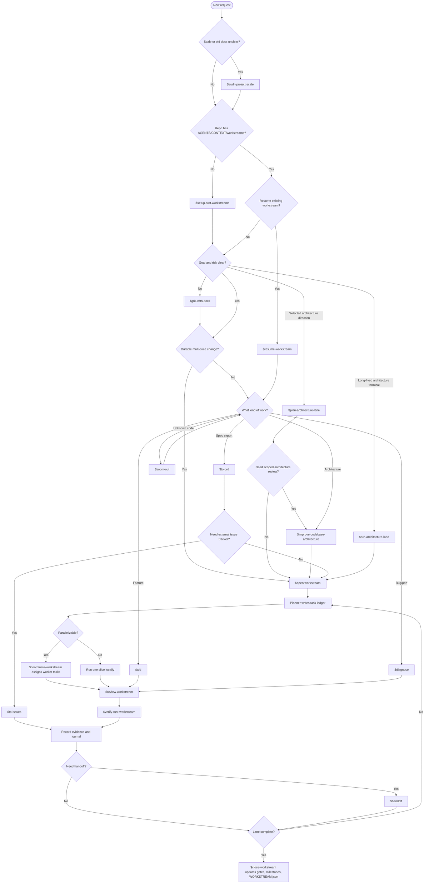
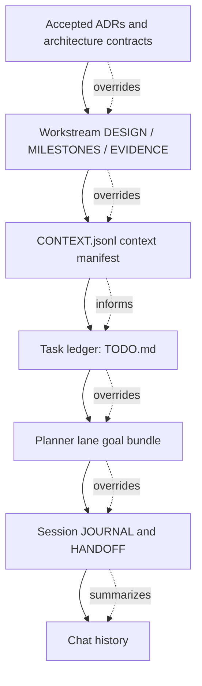
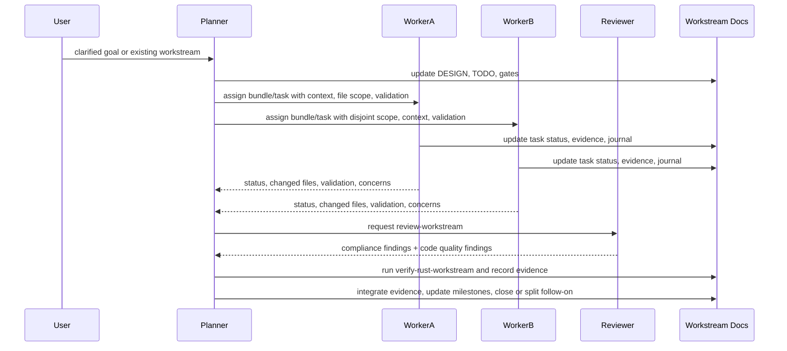

# Dev Workflow

Chinese documentation: [zh-CN/workflow.md](./zh-CN/workflow.md)

This workflow gives a Trellis-like development experience while keeping ADRs and workstreams as the
project source of truth. Skill structure follows the small, composable style used by
`mattpocock/skills`: an entrypoint skill routes the phase, while narrower skills own bootstrap,
planning, implementation, review, verification, diagnosis, and handoff.

`$dev-flow` is an orchestrator: after a delegated skill finishes, return to `$dev-flow` and route the
next phase.

Use `$audit-project-scale` before `$dev-flow` when the repo has stale workflow docs or when it is
unclear whether the work should stay direct, become a workstream, or use architecture lanes.

For large projects, `$run-architecture-lane` is the second user-facing entrypoint. It keeps one
terminal focused on a capability area across multiple related workstreams. Long-running lane
terminals should receive a planner-approved lane goal bundle, not an unbounded lane assignment.

## Skill Router

## Artifact Authority

Rules:

- ADRs are durable contracts.
- Workstreams are durable execution lanes.
- `CONTEXT.jsonl` points lane terminals and workers at the ADRs, architecture docs, evidence, and
  research they must read before editing.
- Planner lane goal bundles are local/runtime assignments: task IDs, scope, context manifest,
  validation, and stop conditions. They never override the task ledger.
- `TODO.md` is the multi-agent task ledger.
- `JOURNAL/` and `HANDOFF.md` are resume aids, not sources of truth.

## Workflow Scale

- **Direct task**: one small bug, feature, or cleanup. Use `tdd` or `diagnose`.
- **Workstream**: durable multi-slice work with gates and closeout.
- **Architecture lane**: one terminal/worktree owns a capability area over multiple workstreams.
- **Lane goal bundle**: one planner-approved execution unit for a lane terminal; bigger than one
  tiny edit, smaller than the whole architecture lane.
- Use `audit-project-scale` when choosing between these shapes is itself uncertain.

## Multi-Agent Execution

Planner creates or reuses workstreams, maintains the task ledger, prepares lane goal bundles, and
owns global sequencing. Lane and worker terminals implement assigned bundles or tasks and report
back; they propose follow-ons instead of redefining target state.
Before this, `$plan-architecture-lane` chooses planning depth and may route to a scoped
`improve-codebase-architecture` pass when lane seams or docs/code alignment are unclear.
Planner output should include the Codex goals to set for approved tasks or lane bundles, not for
whole architecture lanes.

## Standard Development Loop

1. Start with `$dev-flow`.
2. Use `$audit-project-scale` first when repo scale, old docs, or lane fit is unclear.
3. Use `$setup-rust-workstreams` only when the repo lacks workflow docs.
4. Let `$dev-flow` delegate to `$grill-with-docs` before durable or risky work.
5. Use `$plan-architecture-lane` when the user selects an architecture direction before workstream creation.
6. Let `$dev-flow` delegate to `$open-workstream` for large features and refactors.
7. Use `$run-architecture-lane` when one terminal should keep owning a capability area.
8. Use `$coordinate-workstream` from the planner terminal when multiple terminals are active.
9. Planner prepares a lane goal bundle before a long-running lane terminal continues.
10. Let `$run-workstream-task` delegate executable slices to `$tdd` or `$diagnose`.
11. Use `$review-workstream` before accepting completed worker output.
12. Use `$verify-rust-workstream` before marking tasks, goals, or lanes complete.
13. Use `$handoff` before stopping or transferring a session.
14. Close work by updating evidence, gates, milestones, and `WORKSTREAM.json`.

## Workstream Split Rule

Do not create a workstream per task. Create a new workstream only when the work has its own durable
goal, scope boundary, validation gates, and closeout path.

Inside one workstream, split tasks by independently validatable vertical slices.
