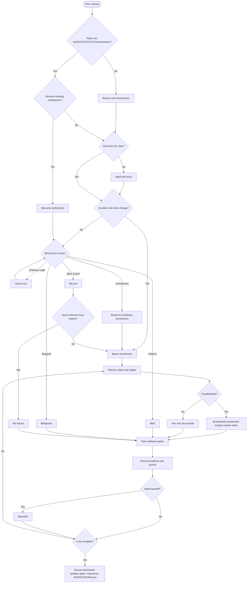
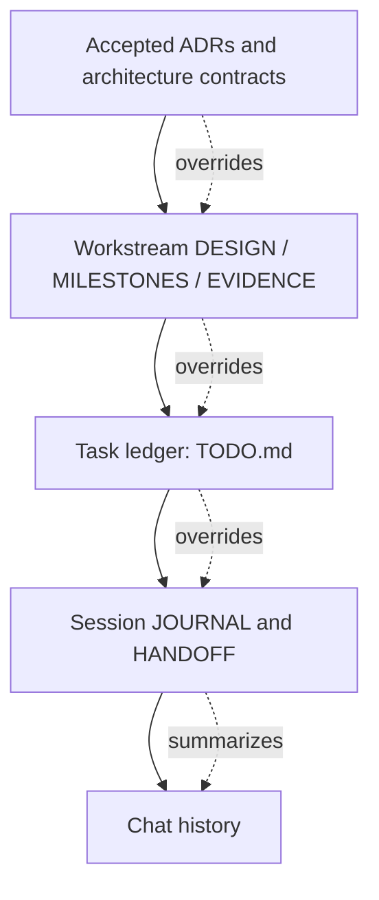
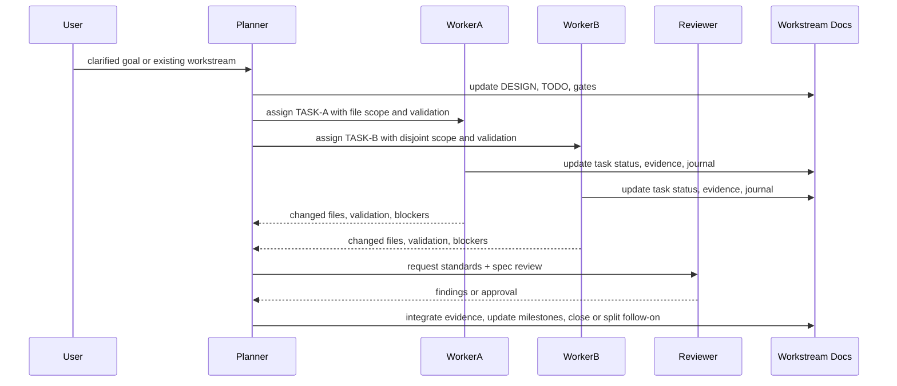

# Dev Workflow

中文文档: [zh-CN/workflow.md](./zh-CN/workflow.md)

This workflow gives a Trellis-like development experience while keeping ADRs and workstreams as the
project source of truth. Skill structure follows the small, composable style used by
`mattpocock/skills`: an entrypoint skill routes the phase, while narrower skills own bootstrap,
planning, implementation, diagnosis, and handoff.

`$dev-flow` is an orchestrator: after a delegated skill finishes, return to `$dev-flow` and route the
next phase.

## Skill Router

## Artifact Authority

Rules:

- ADRs are durable contracts.
- Workstreams are durable execution lanes.
- `TODO.md` is the multi-agent task ledger.
- `JOURNAL/` and `HANDOFF.md` are resume aids, not sources of truth.

## Multi-Agent Execution

## Standard Development Loop

1. Start with `$dev-flow`.
2. Use `$setup-rust-workstreams` only when the repo lacks workflow docs.
3. Let `$dev-flow` delegate to `$grill-with-docs` before durable or risky work.
4. Let `$dev-flow` delegate to `$open-workstream` for large features and refactors.
5. Use `$coordinate-workstream` from the planner terminal when multiple terminals are active.
6. Let `$run-workstream-task` delegate executable slices to `$tdd` or `$diagnose`.
7. Use `$handoff` before stopping or transferring a session.
8. Close work by updating evidence, gates, milestones, and `WORKSTREAM.json`.

## Workstream Split Rule

Do not create a workstream per task. Create a new workstream only when the work has its own durable
goal, scope boundary, validation gates, and closeout path.

Inside one workstream, split tasks by independently validatable vertical slices.
