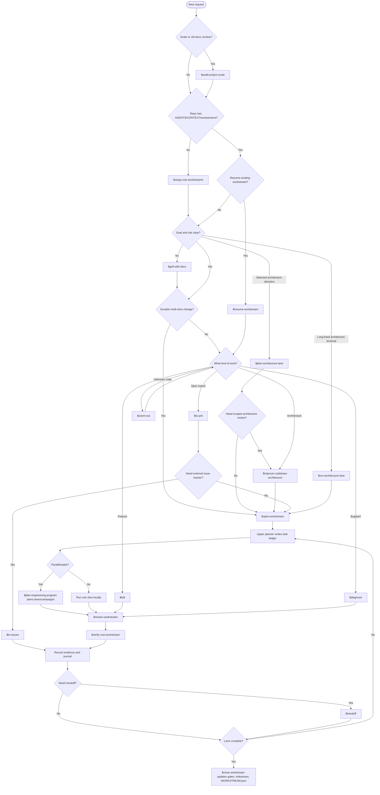
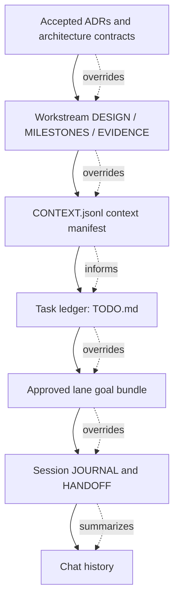
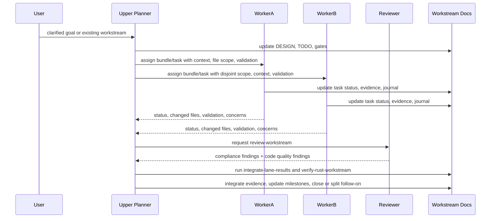

# Dev Workflow

Chinese documentation: [zh-CN/workflow.md](./zh-CN/workflow.md)

This workflow gives a Trellis-like development experience while keeping ADRs and workstreams as the
project source of truth. Skill structure follows the small, composable style used by
`mattpocock/skills`: an entrypoint skill routes the phase, while narrower skills own bootstrap,
planning, implementation, review, verification, diagnosis, and handoff.

`$dev-flow` is an orchestrator: after a delegated skill finishes, return to `$dev-flow` and route the
next phase.

Use `$audit-project-scale` before `$dev-flow` when the repo has stale workflow docs or when it is
unclear whether the work should stay direct, become a workstream, or use architecture lanes.

For large projects, `$run-architecture-lane` is the second user-facing entrypoint. It keeps one
terminal focused on a capability area across multiple related workstreams. Long-running lane
terminals should receive an approved lane goal bundle or campaign, not an unbounded lane
assignment.

## Skill Router

## Artifact Authority

Rules:

- ADRs are durable contracts.
- Workstreams are durable execution lanes.
- `CONTEXT.jsonl` points lane terminals and workers at the ADRs, architecture docs, evidence, and
  research they must read before editing.
- Lane goal bundles are local/runtime assignments: task IDs, scope, context manifest,
  validation, and stop conditions. They never override the task ledger.
- `TODO.md` is the multi-agent task ledger.
- `JOURNAL/` and `HANDOFF.md` are resume aids, not sources of truth.

## Documentation Updates

| Artifact | Update when | Owner |
| --- | --- | --- |
| ADR | A hard-to-change contract, protocol, storage format, compatibility rule, or cross-lane seam changes | Upper planner/docs role after user decision |
| Architecture docs | Current module relationships, lane ownership, or shared scopes changed without needing a new ADR | Upper planner or architecture-lane terminal with approval |
| Workstream docs | Target state, non-goals, milestones, gates, task ledger, or closeout state changed | Upper planner owns target/ledger; workers update assigned task notes and evidence |
| `CONTEXT.md` | Durable domain language is added or clarified | Grill/docs/planner role |
| `CONTEXT.jsonl` | Terminals need a refreshed manifest of required ADRs, architecture docs, evidence, or research | Upper planner |
| `JOURNAL/` / `HANDOFF.md` | Session state may need to be resumed | Current worker/lane/planner |
| Local planner state | Runtime worktree, branch, bundle, session, or terminal facts changed | Upper planner/integrator only; do not commit personal paths |

Workers stop and report `BLOCKED` or `NEEDS_CONTEXT` when a task reveals an ADR-level decision,
architecture target-state change, or shared contract change. Reviewers flag missing documentation
updates; verifiers update evidence from fresh commands. Closeout promotes durable knowledge out of
journals into ADRs, architecture docs, workstream docs, or `CONTEXT.md`.

## Workflow Scale

- **Direct task**: one small bug, feature, or cleanup. Use `tdd` or `diagnose`.
- **Workstream**: durable multi-slice work with gates and closeout.
- **Architecture lane**: one terminal/worktree owns a capability area over multiple workstreams.
- **Lane goal bundle**: one approved execution unit for a lane terminal; bigger than one
  tiny edit, smaller than the whole architecture lane.
- **Lane campaign**: an ordered queue of approved same-lane bundles or workstreams that may run
  under one longer Codex goal with checkpoints and stop conditions.
- **Lane deepening backlog**: architecture-doc state for long-term lane ambition, maturity gaps,
  queued workstreams, validation ladder, and next bundles.
- Use `audit-project-scale` when choosing between these shapes is itself uncertain.

## Multi-Agent Execution

The upper planner creates or reuses workstreams, maintains lane maps and campaign queues, prepares
lane goal bundles, and owns global sequencing. Lane terminals implement approved campaigns and may
propose the next same-lane medium goal; workers implement assigned tasks and report back.
Before this, `$plan-architecture-lane` chooses planning depth and may route to a scoped
`improve-codebase-architecture` pass when lane seams or docs/code alignment are unclear.
Upper-planner output should include the Codex goals to set for approved tasks, lane bundles, or lane
campaigns, not for whole architecture lanes.
When a lane should keep maturing, the upper planner or lane terminal refreshes the lane backlog
before assigning more work; the
Codex goal remains only the next bounded bundle or approved campaign.

## Standard Development Loop

1. Start with `$dev-flow`.
2. Use `$audit-project-scale` first when repo scale, old docs, or lane fit is unclear.
3. Use `$setup-rust-workstreams` only when the repo lacks workflow docs.
4. Let `$dev-flow` delegate to `$grill-with-docs` before durable or risky work.
5. Use `$plan-architecture-lane` when the user selects an architecture direction before workstream creation.
6. Let `$dev-flow` delegate to `$open-workstream` for large features and refactors.
7. Use `$run-architecture-lane` when one terminal should keep owning a capability area.
8. Use `$plan-engineering-program` from the upper architecture terminal when multiple terminals are active.
9. Use `$integrate-lane-results` when completed lane output needs review/verify/merge/sync.
10. Let `$run-workstream-task` delegate executable slices to `$tdd` or `$diagnose`.
11. Use `$review-workstream` before accepting completed worker output.
12. Use `$verify-rust-workstream` before marking tasks, goals, or lanes complete.
13. Use `$handoff` before stopping or transferring a session.
14. Close work by updating evidence, gates, milestones, and `WORKSTREAM.json`.

## Workstream Split Rule

Do not create a workstream per task. Create a new workstream only when the work has its own durable
goal, scope boundary, validation gates, and closeout path.

Inside one workstream, split tasks by independently validatable vertical slices.
