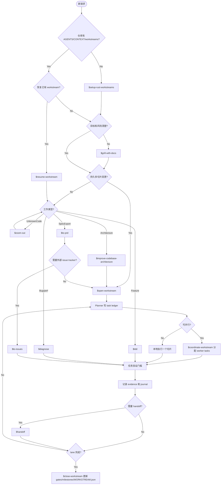

# Dev Workflow

English: [../workflow.md](../workflow.md)

这套流程提供接近 Trellis 的开发体验，同时保持 ADR 和 workstream 是项目事实源。
skill 结构参考 `mattpocock/skills` 的小而可组合风格：入口 skill 负责路由，窄 skill 分别负责初始化、规划、实现、诊断、协调和 handoff。

`$dev-flow` 是 orchestrator。被委托的 skill 完成后，回到 `$dev-flow` 继续路由下一阶段。

## Skill Router



## 文档权威顺序

```text
ADR -> workstream docs -> TODO.md task ledger -> JOURNAL/HANDOFF -> chat
```

规则：

- ADR 是长期契约。
- Workstream 是持久执行通道。
- `TODO.md` 是多 agent 任务账本。
- `JOURNAL/` 和 `HANDOFF.md` 是恢复辅助，不是事实源。

## 标准开发循环

1. 从 `$dev-flow` 开始。
2. 仓库缺工作流文档时用 `$setup-rust-workstreams`。
3. 持久或高风险工作前，让 `$dev-flow` 委托给 `$grill-with-docs`。
4. 大功能和重构由 `$dev-flow` 委托给 `$open-workstream`。
5. 多终端活跃时，planner 终端使用 `$coordinate-workstream`。
6. 可执行切片由 `$run-workstream-task` 委托给 `$tdd` 或 `$diagnose`。
7. 停止或转交前使用 `$handoff`。
8. 收尾时更新 evidence、gates、milestones 和 `WORKSTREAM.json`。

## Workstream 拆分规则

不要为每个小任务创建 workstream。只有当工作有自己的持久目标、范围边界、验证门槛和收尾路径时，才创建新 workstream。

在同一个 workstream 内，按可独立验证的垂直切片拆任务。
