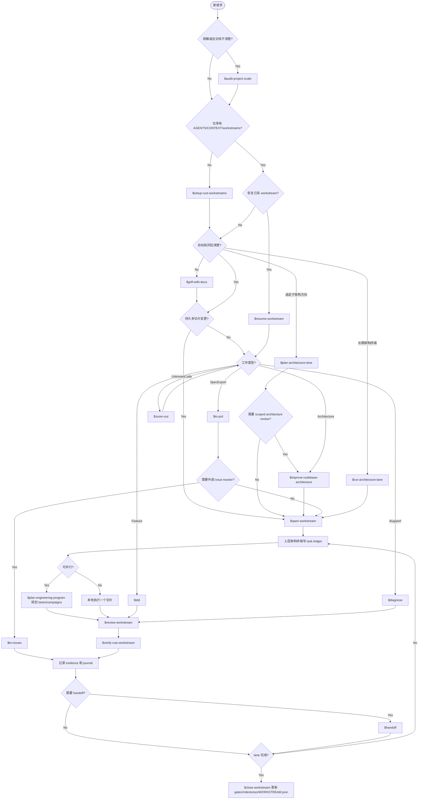

# Dev Workflow

English: [../workflow.md](../workflow.md)

这套流程提供接近 Trellis 的开发体验，同时保持 ADR 和 workstream 是项目事实源。
skill 结构参考 `mattpocock/skills` 的小而可组合风格：入口 skill 负责路由，窄 skill 分别负责初始化、规划、实现、review、验证、诊断、结果集成和 handoff。

`$dev-flow` 是 orchestrator。被委托的 skill 完成后，回到 `$dev-flow` 继续路由下一阶段。

当仓库存在旧工作流文档，或不确定应该走 direct task、workstream 还是 architecture lane 时，
先用 `$audit-project-scale`。

大型项目里，`$run-architecture-lane` 是第二个用户入口。它让一个终端长期专注某个能力域，
并连续推进该能力域下的一组 workstreams。长期 lane 终端应该接收上层架构终端批准的
lane goal bundle 或 campaign，而不是一个无边界的 lane 指派。

## Skill Router



## 文档权威顺序

```text
ADR -> workstream docs -> CONTEXT.jsonl -> TODO.md task ledger -> lane goal bundle -> JOURNAL/HANDOFF -> chat
```

规则：

- ADR 是长期契约。
- Workstream 是持久执行通道。
- `CONTEXT.jsonl` 指向编辑前必须阅读的 ADR、architecture docs、evidence 和 research。
- `TODO.md` 是多 agent 任务账本。
- Lane goal bundle 是上层 planner 的本地 / 运行态指派：task IDs、scope、context manifest、
  validation 和 stop conditions，不能覆盖 task ledger。
- `JOURNAL/` 和 `HANDOFF.md` 是恢复辅助，不是事实源。

## 文档更新判断

| 文档 | 什么时候更新 | 负责人 |
| --- | --- | --- |
| ADR | 难以回滚的契约、协议、存储格式、兼容性规则或 cross-lane seam 变化 | 用户决策后由上层 planner/docs 角色处理 |
| Architecture docs | 当前模块关系、lane ownership 或 shared scopes 变化，但不需要新 ADR | 上层 planner 或获批的 architecture-lane 终端 |
| Workstream docs | Target state、non-goals、milestones、gates、task ledger 或 closeout 状态变化 | 上层 planner 负责目标和 ledger；worker 只更新分配任务的 notes/evidence |
| `CONTEXT.md` | 持久领域语言新增或被澄清 | Grill/docs/planner 角色 |
| `CONTEXT.jsonl` | 终端需要新的 ADR、architecture docs、evidence 或 research manifest | 上层 planner |
| `JOURNAL/` / `HANDOFF.md` | 会话状态需要可恢复 | 当前 worker/lane/planner |
| 本地 planner state | worktree、branch、bundle、session 或 terminal 运行态变化 | 仅上层 planner / integrator；不要提交个人路径 |

当任务暴露 ADR 级决策、architecture target-state 变化或 shared contract 变化时，worker 停止并报告
`BLOCKED` 或 `NEEDS_CONTEXT`。Reviewer 负责指出缺失的文档更新；Verifier 用新鲜命令结果更新
evidence。Closeout 阶段要把 durable knowledge 从 journal 提升到 ADR、architecture docs、
workstream docs 或 `CONTEXT.md`。

## 工作流规模

- **Direct task**：一个小 bug、小功能或小清理，使用 `tdd` 或 `diagnose`。
- **Workstream**：有验证门槛和收尾条件的持久多切片工作。
- **Architecture lane**：一个终端 / worktree 长期负责一个能力域，连续推进多个 workstreams。
- **Lane goal bundle**：上层架构终端批准给 lane 终端的执行单元；大于一次机械小改，小于整个 architecture lane。
- **Lane campaign**：上层架构终端批准的一组有序同 lane bundles 或 workstreams，可在一个更长 Codex goal 下按 checkpoint 和 stop conditions 执行。
- **Lane deepening backlog**：存在 architecture docs 里的长期 lane 愿景、成熟度差距、workstream 队列、validation ladder 和 next bundles。
- 当你不确定该选哪一种时，先用 `audit-project-scale`。

上层架构终端创建或复用 workstream、维护 task ledger、准备 lane goal bundle，并负责全局顺序。
Lane / worker 终端实现分配的 bundle 或 task；它们可以提出同 lane 的下一个中型目标，但不重新定义全局目标状态。
在此之前，`$plan-architecture-lane` 选择 planning depth；lane seam / docs/code 对齐不清楚时，
它可以转到 scoped `improve-codebase-architecture`。
上层架构终端输出应包含已批准 task、lane bundle 或 lane campaign 要设置的 Codex goals，而不是整个 architecture lane 的 goal。
当某条 lane 要持续成熟时，上层架构终端先刷新 lane backlog，再继续分配任务；Codex goal 仍然只绑定下一个有边界 bundle 或批准的 campaign。

## 标准开发循环

1. 从 `$dev-flow` 开始。
2. 仓库规模、旧文档或 lane 适配性不清楚时，先用 `$audit-project-scale`。
3. 仓库缺工作流文档时用 `$setup-rust-workstreams`。
4. 持久或高风险工作前，让 `$dev-flow` 委托给 `$grill-with-docs`。
5. 用户选定子架构方向且还未创建 workstream 时，使用 `$plan-architecture-lane`。
6. 大功能和重构由 `$dev-flow` 委托给 `$open-workstream`。
7. 一个终端需要长期负责某个能力域时，使用 `$run-architecture-lane`。
8. 多终端活跃时，上层架构终端使用 `$plan-engineering-program`。
9. 已完成的 lane / worker 输出需要进入 review、verify、merge 或 sync 时，使用 `$integrate-lane-results`。
10. 可执行切片由 `$run-workstream-task` 委托给 `$tdd` 或 `$diagnose`。
11. 接受 worker 产出前使用 `$review-workstream`。
12. 标记任务、goal 或 lane 完成前使用 `$verify-rust-workstream`。
13. 停止或转交前使用 `$handoff`。
14. 收尾时更新 evidence、gates、milestones 和 `WORKSTREAM.json`。

## Workstream 拆分规则

不要为每个小任务创建 workstream。只有当工作有自己的持久目标、范围边界、验证门槛和收尾路径时，才创建新 workstream。

在同一个 workstream 内，按可独立验证的垂直切片拆任务。
