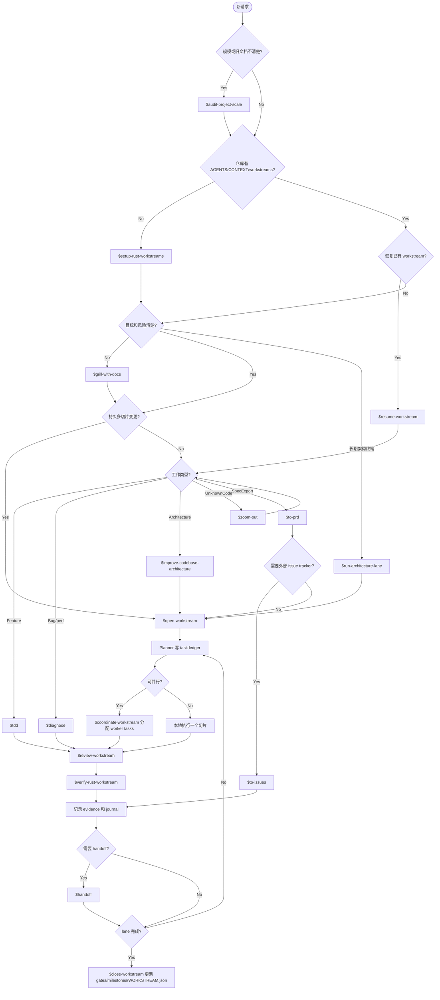

# Dev Workflow

English: [../workflow.md](../workflow.md)

这套流程提供接近 Trellis 的开发体验，同时保持 ADR 和 workstream 是项目事实源。
skill 结构参考 `mattpocock/skills` 的小而可组合风格：入口 skill 负责路由，窄 skill 分别负责初始化、规划、实现、review、验证、诊断、协调和 handoff。

`$dev-flow` 是 orchestrator。被委托的 skill 完成后，回到 `$dev-flow` 继续路由下一阶段。

当仓库存在旧工作流文档，或不确定应该走 direct task、workstream 还是 architecture lane 时，
先用 `$audit-project-scale`。

大型项目里，`$run-architecture-lane` 是第二个用户入口。它让一个终端长期专注某个能力域，
并连续推进该能力域下的一组 workstreams。

## Skill Router



## 文档权威顺序

```text
ADR -> workstream docs -> TODO.md task ledger -> JOURNAL/HANDOFF -> chat
```

规则：

- ADR 是长期契约。
- Workstream 是持久执行通道。
- `TODO.md` 是多 agent 任务账本。
- `JOURNAL/` 和 `HANDOFF.md` 是恢复辅助，不是事实源。

## 工作流规模

- **Direct task**：一个小 bug、小功能或小清理，使用 `tdd` 或 `diagnose`。
- **Workstream**：有验证门槛和收尾条件的持久多切片工作。
- **Architecture lane**：一个终端 / worktree 长期负责一个能力域，连续推进多个 workstreams。
- 当你不确定该选哪一种时，先用 `audit-project-scale`。

## 标准开发循环

1. 从 `$dev-flow` 开始。
2. 仓库规模、旧文档或 lane 适配性不清楚时，先用 `$audit-project-scale`。
3. 仓库缺工作流文档时用 `$setup-rust-workstreams`。
4. 持久或高风险工作前，让 `$dev-flow` 委托给 `$grill-with-docs`。
5. 大功能和重构由 `$dev-flow` 委托给 `$open-workstream`。
6. 一个终端需要长期负责某个能力域时，使用 `$run-architecture-lane`。
7. 多终端活跃时，planner 终端使用 `$coordinate-workstream`。
8. 可执行切片由 `$run-workstream-task` 委托给 `$tdd` 或 `$diagnose`。
9. 接受 worker 产出前使用 `$review-workstream`。
10. 标记任务、goal 或 lane 完成前使用 `$verify-rust-workstream`。
11. 停止或转交前使用 `$handoff`。
12. 收尾时更新 evidence、gates、milestones 和 `WORKSTREAM.json`。

## Workstream 拆分规则

不要为每个小任务创建 workstream。只有当工作有自己的持久目标、范围边界、验证门槛和收尾路径时，才创建新 workstream。

在同一个 workstream 内，按可独立验证的垂直切片拆任务。
